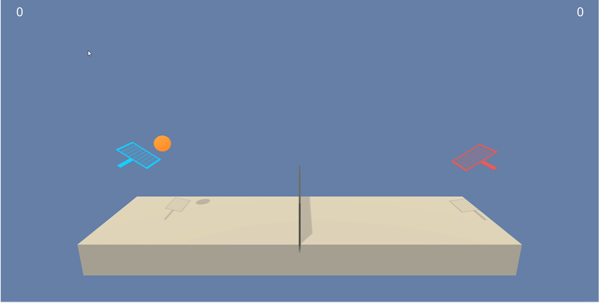
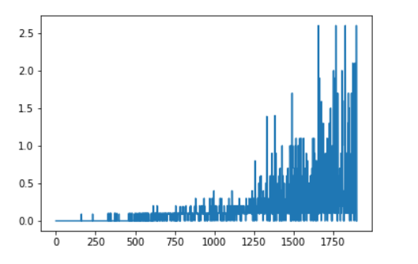

# Deep Reinforcement learning Collaboration and Competition

The project focusses on training a multi agent environment by making the agents collaborate to get a high reward. The goal of the project is to train agents to play tennis in a pre-built unity environment provided by Udacity. The agents were trained to collaborate so as to retain the ball between the agents without lossing it in the ground or inside the net or outside the court.

The observation space consists of 8 variables corresponding to the position and velocity of the ball and racket. Each agent receives its own, local observation. The states are stacked into 3 frames and passed as input to the agents. Two continuous actions are available, corresponding to movement toward (or away from) the net, and jumping.




<h2> Goal </h2>

In this environment, two agents control rackets to bounce a ball over a net. If an agent hits the ball over the net, it receives a reward of +0.1. If an agent lets a ball hit the ground or hits the ball out of bounds, it receives a reward of -0.01. Thus, the goal of each agent is to keep the ball in play.

The task is episodic, and in order to solve the environment, your agents must get an average score of +0.5 (over 100 consecutive episodes, after taking the maximum over both agents). Specifically,

<UL>
<LI>After each episode, we add up the rewards that each agent received (without discounting), to get a score for each agent. This yields 2 (potentially different) scores. We then take the maximum of these 2 scores.</LI>
<LI>This yields a single score for each episode.</LI>
</UL>
The environment is considered solved, when the average (over 100 episodes) of those scores is at least +0.5.

<h2>Model </h2>

The model we use here is multi agent version of DDPG algorithm(Deep Deterministic policy gradient). The model consists of an actor and critic models which contains dense neural networks. The actor model takes the state as input and produces a continuous value for the two actions. We use a tanh function so as to have the value between -1 and +1 as supported by the environment. The critic model takes the state and the continous values for both action and provided the Q value for the particular action.


The main idea is that the actor takes the states of one agent whereas the critic takes the states and the predicted continous value for actions of both agents and computes the Q value of the action.

We take the state and actions of both the agents in critic to solve the dynamic environment nature in multi agent systems. Since the both the agents are dynamic, the environment may vary each time for every agent.
 
<h2>Model Architecture</h2>

<h3>Actor Model</h3>

```
Actor(
  (fc1): Linear(in_features=24, out_features=256, bias=True)
  (fc2): Linear(in_features=256, out_features=128, bias=True)
  (fc3): Linear(in_features=128, out_features=2, bias=True)
)
```
<h3>Critic Model</h3>

```
Critic(
  (fc1): Linear(in_features=48, out_features=256, bias=True)
  (fc2): Linear(in_features=260, out_features=128, bias=True)
  (fc3): Linear(in_features=128, out_features=1, bias=True)
)
```

<h2>Training</h2>

The model is being trained for 5000 episodes. Whenever the ball is missed by the agent the episode gets over. The Ornstein-Uhlenbeck process noise is also added to provide more exploration in the environment. 

In each iteration both the agents learn based on each of their action.Thus both the agents work together collaborately to increase the final reward.

Based on the below set of hyperparameters the agent learned to solve the environment in 1900 episodes with an Average Score of 0.5886. 

<h2>Hyperparameters</h2>

```
BUFFER_SIZE = int(1e5)
BATCH_SIZE = 128 
GAMMA = 0.99
TAU = 7e-2
LR_ACTOR = 1e-3
LR_CRITIC = 1e-4
WEIGHT_DECAY = 0
EPSILON = 5.5
EPSILON_DECAY = 1e-4
EPSILON_FINAL = 0.001
LEARN_EVERY = 1

```

<h2>Implementation</h2>

The model is being trained in Udacity environment using the above hyperparameters.

The link to the simulation environments from udaicty is below.

<ul>
<li>Linux: <a target="_blank" href="https://s3-us-west-1.amazonaws.com/udacity-drlnd/P3/Tennis/Tennis_Linux.zip">click here</a></li>
<li>Mac OSX: <a target="_blank" href="https://s3-us-west-1.amazonaws.com/udacity-drlnd/P3/Tennis/Tennis.app.zip">click here</a></li>
<li>Windows (32-bit): <a target="_blank" href="https://s3-us-west-1.amazonaws.com/udacity-drlnd/P3/Tennis/Tennis_Windows_x86.zip">click here</a></li>
<li>Windows (64-bit): <a target="_blank" href="https://s3-us-west-1.amazonaws.com/udacity-drlnd/P3/Tennis/Tennis_Windows_x86_64.zip">click here</a></li>
</ul>


<h2>Environment Setup</h2>

```
Install anaconda python

Create new conda environment
conda create -n ml-agents python=3.6
conda activate ml-agents

Install Cuda toolkit and CuDNN library
Cuda 11.2.2
cuDNN 8.1.0

pip install tensorflow-gpu
conda install pytorch torchvision torchaudio cudatoolkit=11.0 -c pytorch
pip install unityagents
pip install mlagents

move to the path
jupyter notebook <ipynb file name>

```

<h2>Training</h2>

```
Clone this repo and place the simulator inside the folder of the project(already done for Windows).

To Run training.
Go to downloaded folder
jupyter notebook Tennis_final.ipynb

To Run testing.
Go to Single agent folder
jupyter notebook Testing.ipynb

```

<h2>Result</h2>

The environment solved in 1900 episodes with an Average Score of 0.5886.



<h2>Testing</h2>

To test the model,use Testing.ipynb notebook. The simulator can run only once each time the kernel is opened as once the environment is closed the port is lost. So each time we need to restart kernel and run.

```
Video link

```

<h2>Future Improvements</h2>

As the multiagent DDPG algorithm takes a lot of time to train, we can try to use multi agent version D4PG,A3C and other PPO algorithms. We can also use prioritized experience replay to select more complicated states many times while training.


